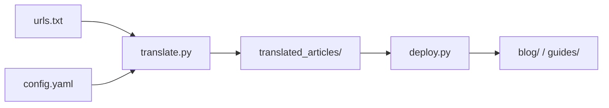

# 工具链（tools/）设计文档

本文档描述仓库内 **离线/本地工具** 的职责划分、数据流、配置与依赖，与面向访客的网站运行时分离。

## 1. 目标与边界

| 目标 | 说明 |
|------|------|
| 从 URL 批量抓取文章 | 处理静态页与 SPA，输出站点可用的 HTML |
| 翻译与重写 | 多后端（DeepSeek / OpenAI / 等），可切块、缓存、重试 |
| 内容进站 | 将产物归类到 `blog/` 或 `guides/` 并维护索引页 |
| 站点 i18n 辅助 | 为现有 HTML 批量加选择器、`data-i18n`、`data-translate` 等 |
| 本地文章译稿 | 将已有中英文文章 HTML 整页译为指定语言（见 `article_to_target_page.py`） |

**边界**：工具 **不** 在访客浏览器内执行；**不** 替代 Cloudflare Functions；密钥与代理属于运维机密，默认不进仓库。

## 2. 目录结构（逻辑视图）

```
tools/
├── i18n/                    # 针对已存在站点 HTML 的批量处理
│   ├── add-i18n-support.py
│   ├── add-translate-attributes.py
│   ├── multi_lang_translator.py
│   └── article_to_target_page.py  # 中/英文章 → 目标语 HTML 页面
├── url-translate/           # URL → 翻译/重写 → HTML 产物
│   ├── translate.py         # 主程序（配置、抓取、翻译、写盘）
│   ├── browser_fetcher.py   # Selenium/Playwright 等浏览器抓取
│   ├── config.yaml          # 本地配置（勿提交真实 API Key）
│   ├── urls.txt             # 待处理 URL 列表
│   └── translated_articles/ # 默认输出目录（含 .cache / .debug 时为运行产物）
├── deploy/                  # 产物 → 站点目录
│   └── deploy.py
└── browser/                 # 浏览器环境辅助
    ├── install_chromedriver.sh
    ├── check_browser.py
    ├── INSTALL_BROWSER.md
    └── BROWSER_AUTOMATION.md
```

## 3. 子系统说明

### 3.1 `tools/url-translate`（抓取与翻译流水线）

**核心脚本**：`translate.py`

- **输入**：`config.yaml`（推荐）或命令行参数；URL 列表来自 `urls_file` 指向的文件（相对路径相对于 **配置文件所在目录** 解析）。
- **输出**：`output_dir` 下的 HTML 文件，以及可选 `.cache`、`.debug`（失败诊断）。
- **抓取策略**：HTTP 客户端为主；对难抓页面可启用 **浏览器自动化**（配置项 `use_browser`、`browser_type` 等），具体实现见 `browser_fetcher.py`。
- **翻译后端**：可配置多种 backend；API Key 优先从环境变量读取（如 `DEEPSEEK_API_KEY`），避免写入版本库。

**设计要点**：

- 配置中的相对路径在加载 YAML 时解析为绝对路径，便于在 **仓库根目录** 执行：  
  `python3 tools/url-translate/translate.py --config tools/url-translate/config.yaml`
- 遵守 robots.txt、超时、并发与重试等策略在脚本内实现（以代码为准）。

### 3.2 `tools/browser`（环境与支持文档）

- **install_chromedriver.sh**：在 Linux/WSL 下辅助安装 Chrome / ChromeDriver。
- **check_browser.py**：检查 Chrome、ChromeDriver、Selenium 等是否可用。
- **文档**：说明 Playwright 与 Selenium 在 WSL 下的差异与推荐配置。

与 `translate.py` 的衔接：日志或异常信息中提示的安装命令使用仓库相对路径 **`tools/browser/install_chromedriver.sh`**。

### 3.3 `tools/deploy`（进站与索引维护）

**核心脚本**：`deploy.py`

- **默认源目录**：`tools/url-translate/translated_articles`（相对仓库根）。
- **目标**：`blog/`、`guides/`、`index.html` 及各目录下的 `index.html` 列表更新（逻辑以脚本内实现为准）。
- **模式**：支持按目录自动分类、`--target` 指定、`--file` 单文件、`--delete` 下架、`--rebuild` 重建索引等。

**设计要点**：`deploy.py` 位于 `tools/deploy/`，通过 `Path(__file__).resolve().parent.parent.parent` 定位仓库根，保证脚本从任意 cwd 调用时路径一致（与传入的 `--source-dir` 配合）。

### 3.4 `tools/i18n`（站点 HTML 批量改造）

| 脚本 | 用途 |
|------|------|
| `add-i18n-support.py` | 扫描 HTML，注入语言选择器、公共脚本引用、`data-i18n` 等 |
| `add-translate-attributes.py` | 为标题、正文等添加 `data-translate` |
| `multi_lang_translator.py` | 基于现有文章生成多语言文件（如 `article.ja.html`） |
| `article_to_target_page.py` | 读取 **站内文章 HTML**（中文或英文），用与 `translate.py` 相同的后端（DeepSeek / OpenAI / simple 等）批量翻译，写出 `{原名}.{目标语言}.html`；默认只处理 `.article-header`、`.article-content` 及 `<title>` / `meta description`，避免动到导航 |

**设计要点**：扫描时 **排除** `tools/url-translate/translated_articles`，避免把抓取中间产物当站点页面处理。

## 4. 端到端数据流（典型）



编辑与发布静态页后，可用 `tools/i18n` 下脚本做批量标记或多语言文件生成（与上流水线独立或组合使用）。

## 5. 配置、秘密与 `.gitignore`

- **`config.yaml`**：仅保留非敏感默认值与结构说明；**API Key 使用环境变量**。
- **仓库 `.gitignore`**：建议忽略 `tools/url-translate/translator.log`、`translated_articles/.cache/`、`translated_articles/.debug/`、`__pycache__/` 等，避免运行垃圾进入版本控制。

## 6. 依赖（运行时）

以实际 import 为准，常见包括：

- Python 3：`beautifulsoup4`、`aiohttp`、`pyyaml`；可选 `trafilatura`、`readability`、`selenium`、`playwright`、`tqdm` 等。
- 浏览器抓取路径需本机 Chrome/Chromium 与匹配驱动或 Playwright 浏览器二进制。

建议在独立 venv 中安装，与站点静态文件无耦合。

## 7. 与网站文档的关系

- 访客可见行为、评论 API、i18n 页面约定见 [网站设计文档](./website-design.md)。
- 运营说明与分步教程可继续放在 `docs/i18n-*.md`、`article-i18n-guide.md` 等；本文档侧重 **工具模块边界与数据流**。
