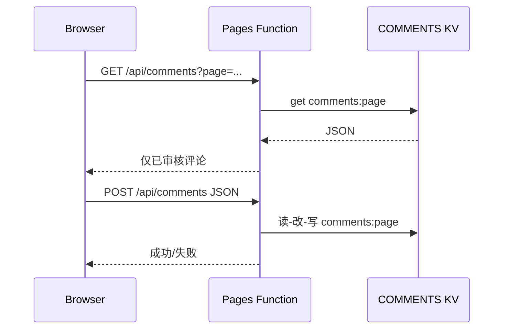

# Travel-China.Help 网站设计文档

本文档描述面向访客的静态网站架构、内容组织与运行时行为，便于维护与扩展。

## 1. 产品定位与范围

- **定位**：面向外国游客的中国旅行帮助站点，聚合真实游记（故事）、实用攻略（guides）与博文（blog），辅以关于我们、联系与隐私等合规页面。
- **技术形态**：以 **静态 HTML + 客户端 JavaScript** 为主，评论等能力通过 **Cloudflare Workers（Pages Functions）** 与 **KV** 提供简单后端。
- **不在本文档范围内**：`tools/` 下离线脚本与流水线（见 [工具设计文档](./tools-design.md)）。

## 2. 信息架构（IA）

### 2.1 顶层导航（典型结构）

| 区域 | 路径 | 说明 |
|------|------|------|
| 首页 | `index.html` | 品牌入口、精选故事与攻略摘要 |
| 旅行故事 / Blog | `blog/index.html` 及 `blog/*.html` | 叙事类、体验类文章列表与详情 |
| 攻略 | `guides/index.html` 及 `guides/*.html` | 签证、交通、应用、网络等实用指南 |
| 关于 / 联系 / 隐私 | `about.html`, `contact.html`, `privacy.html` | 站点信息与合规 |
| 管理（非公开推广） | `admin.html` | 评论审核等（宜配合访问控制） |

### 2.2 内容与命名

- **Blog**：单篇多为独立 HTML，由索引页链入。
- **Guides**：同上；部分页面标题较长，文件名可能截断，以实际文件名为准。
- **SEO**：`sitemap.xml` 列出主要 URL；`robots.txt` 声明爬取策略（含对 `/tools/`、`/admin.html`、`/functions/` 等路径的限制，若线上存在对应路径）。

## 3. 前端架构

### 3.1 页面实现方式

- 页面为 **独立 HTML**，内联或引用样式；公共交互通过 `js/` 下脚本复用。
- **视觉**：主色为中国红系渐变（如 `#c41e3a`），白底内容区，粘性顶栏导航。

### 3.2 静态资源

| 资源 | 路径 | 用途 |
|------|------|------|
| 站点级样式（可选拆分） | `css/main.css`, `css/blog.css`, `css/guides.css` | 按页面类型复用 |
| 国际化词条 | `js/translations.js` | UI 文案多语言键值 |
| 语言切换与 DOM 应用 | `js/i18n.js` | 读取 `data-i18n`，切换 `lang` 与文案 |
| 文章区通用脚本片段 | `js/common-i18n-scripts.js` | 减少各页重复引用 |
| 文章内联翻译（动态） | `js/article-i18n.js`, `js/article-content-i18n.js` | 配合 `data-translate` 等标记 |
| 评论前端 | `js/comments.js` | 调用 `/api/comments` |

### 3.3 国际化（i18n）设计要点

- **UI 层**：元素使用 `data-i18n="键"`；`meta` 的 title/description 也可挂 `data-i18n`，由 `i18n.js` 统一替换。
- **正文层**：可选 `data-translate="true"` 等策略，由文章脚本在语言切换时请求翻译（具体 API 与限额见实现与运维配置）。
- **语言选择器**：顶栏下拉；切换后触发 `languageChanged` 等约定事件，供文章脚本联动。

## 4. 评论子系统

### 4.1 运行时数据流

### 4.2 服务端模块

- `functions/api/comments.js`：访客 **GET**（只返回 `approved`）、**POST**（提交新评论，默认待审）。
- `functions/api/admin-comments.js`：管理员审核、列表等（需与 `admin.html` 及密钥/鉴权策略一致）。

### 4.3 客户端

- `js/comments.js` 中 `apiBase = '/api/comments'`，`pageName` 区分页面维度存储键（如 `comments:blog/foo`）。

**设计约束**：KV 值为 JSON 数组；高流量站点需考虑并发写入与体积上限，当前模型适合轻量站点。

## 5. 安全与隐私（网站侧）

- 评论表单字段校验在 Functions 内完成；展示前必须 **HTML 转义**（见 `comments.js` 的 `escapeHtml`）。
- **邮箱**等敏感字段不应在公开 API 中返回给浏览器（以当前实现为准做审计）。
- `admin.html` 与审核接口应 **不暴露于公网爬虫**（`robots.txt` 仅作提示，不能替代鉴权）。

## 6. 部署与域名假设

- 生产域名在 `sitemap.xml` 等处以 `https://travel-china.help/` 为示例；实际部署时应对齐环境。
- 静态资源与 HTML 可由 **Cloudflare Pages**（或同类）托管；Functions 与 KV 绑定在同一项目中。

## 7. 扩展建议（非当前强制）

- 为 blog/guides 文章模板抽取公共 **head / nav / footer** 片段，减少复制粘贴。
- 多语言 **hreflang** 与独立 URL 策略若上线，需与当前「单页多语言」模型协调。
- 评论反垃圾（速率限制、验证码、第三方服务）可按流量逐步加入。

## 8. 相关文档

- [工具设计文档](./tools-design.md)：URL 翻译、部署进站、批量 i18n 标记等离线工具链。
